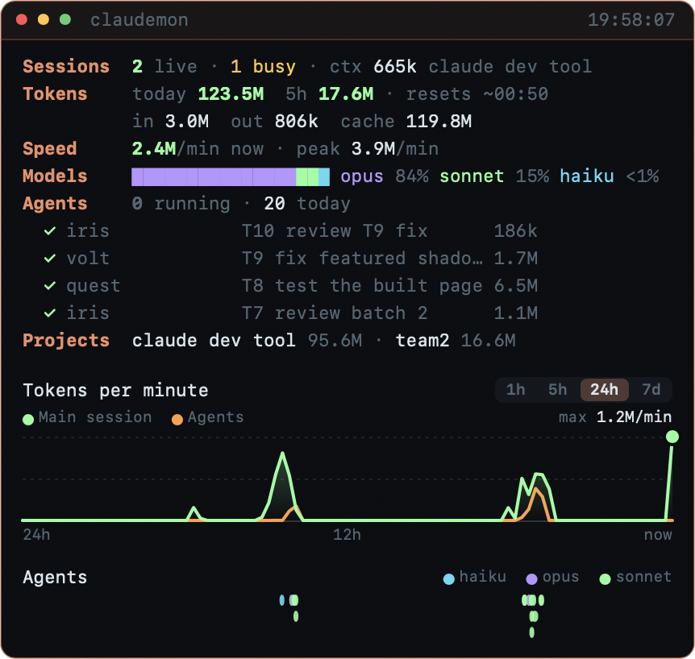

# Claudemon

> **Community project, not affiliated with or endorsed by Anthropic.** "Claude" and "Claude Code" are trademarks of Anthropic.

A tiny floating dashboard for your [Claude Code](https://code.claude.com) usage on macOS: tokens, speed, models, subagents and projects, updated every second.



## What it shows

| Row | Meaning |
|-----|---------|
| **Sessions** | Claude Code sessions running now, how many are busy, and the context size of your latest conversation |
| **Tokens** | Tokens used today and in the current 5-hour window, split into input, output and cache reads |
| **Speed** | Tokens per minute right now, and the peak minute in the last hour |
| **Models** | Share of today's tokens by model (opus, sonnet, haiku, fable) |
| **Agents** | Subagents running now and run today, each with its type, task, tokens and run time |
| **Projects** | The projects that used the most tokens today |
| **Chart** | Tokens per minute over the last **1h, 5h or 24h**, with separate lines for your main session and for subagents |
| **Activity** | The **7d** view: a heatmap of tokens per hour over the last 7 days |
| **Agent timeline** | One bar per subagent showing when it ran, colored by model. Appears only when agents ran in the chosen range. |

**Hover over anything for details:** every row, any point on the chart, a timeline bar or a heatmap cell. For example, the Tokens row shows exact input, cache and output counts.

### Live signals

- The border glows while subagents are running.
- Numbers count up smoothly, and new agents fade in.
- All motion turns off when "Reduce motion" is on in macOS accessibility settings.

## Install

Requires macOS 11 or later and Apple's command line tools (`xcode-select --install` if you don't have them).

```bash
git clone https://github.com/prantopi/claudemon.git
cd claudemon
./build.sh
open Claudemon.app
```

To start it automatically, add `Claudemon.app` under System Settings → General → Login Items.

## Controls

| To | Do this |
|----|---------|
| Change the time range | Click `1h`, `5h`, `24h` or `7d` above the chart, or press `1` to `4` |
| Shrink to one line | Double-click the title bar, or press `c`. Do it again to expand. |
| Change the theme | Right-click → Theme: **Terminal**, **Claude** (warm orange) or **Match System** (light or dark, following macOS) |
| Keep it above other windows | Right-click → Always on Top |
| Move it | Drag anywhere |
| Quit | Click the red dot, press `q` or `Esc`, or right-click → Quit |

Claudemon remembers its position, time range, theme and compact mode between launches.

## How it works

Claude Code saves every conversation on your Mac in `~/.claude/projects/`, including exact token counts for each reply. Claudemon reads the last 7 days of those files at launch, then only the new lines each second. It also checks `~/.claude/sessions/` to see which sessions are running.

**Nothing leaves your Mac.** Claudemon makes no network requests and needs no API key or login.

## Limitations

- **The 5-hour window is an estimate.** It starts at your first message after a 5-hour gap. Your actual plan limits aren't stored locally, so Claudemon can't show a percentage of your limit.
- **No cost in dollars.** Prices differ by model and change over time, so Claudemon shows tokens only.
- **Cache reads dominate the totals.** That's normal: Claude re-reads your conversation's context on every reply. The `out` figure is what Claude actually wrote.
- **macOS only.** It's a native Swift app.

## Part of Claude Code Dev Team

Claudemon is also included in [claude-code-dev-team](https://github.com/prantopi/claude-code-dev-team), a set of 9 subagents that work in parallel. Claudemon shows each agent live as it runs.

## License

[MIT](./LICENSE)
